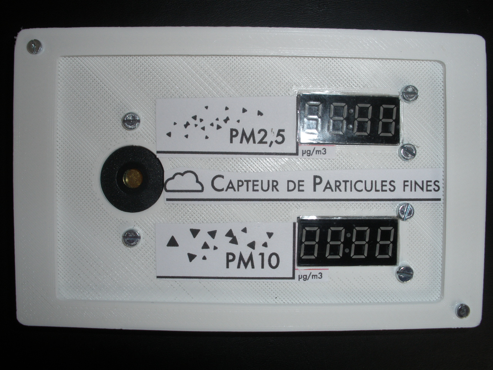
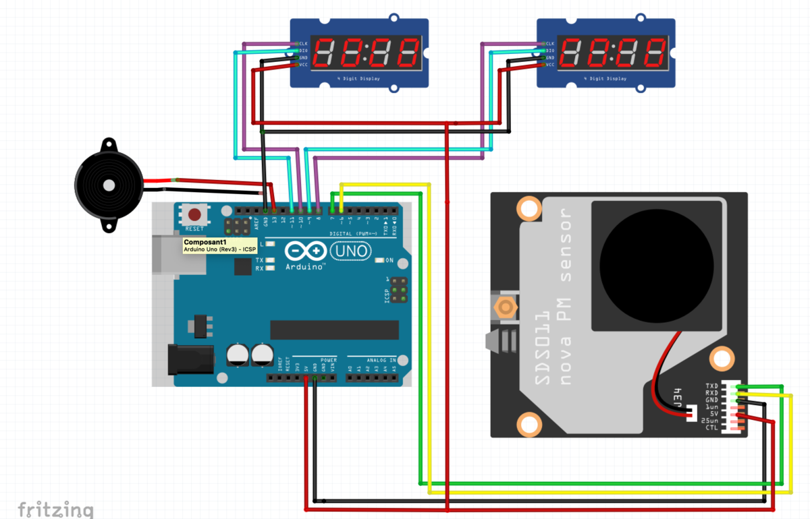

<!--# Capteur de pollution atmosphérique -->
<!--$ Arduino-->
<!--$ Freecad-->
<!--% Un projet pour un capteur de pollution atmosphérique. Il indique si un certain nombre de particules fines dépasse la norme. -->

# Capteur de pollution atmosphérique

Un projet pour un capteur de pollution atmosphérique. Il indique si un certain nombre de particules fines dépasse la norme.

Maintenant votre boîtier en deux parties prêt, vous allez pouvoir passer au fixation des composants et au câblage de l'ensemble. On fera cela en 3 temps : 

- Fixer l’Arduino et le capteur de particules (SDS011) au fond du boîtier. Pour que ceux-ci ne bougent plus, munissez-vous de 7 paires boulons-écrous (diam. 2,5mm) et visez-les dans les 7 trous correspondants. 

- Ensuite prenez câbles et jumpers pour réaliser les câblage comme suit : 

- Arduino - pin 6 > RX (SDS011) 
- Arduino - pin 7 > TX (SDS011) 
- Arduino - pin 8 > CLK (TM1637 n°1) 
- Arduino - pin 9 > DIO (TM1637 n°1) 
- Arduino - pin 10 > CLK (TM1637 n°2) 
- Arduino - pin 11 > DIO (TM1637 n°2) 
- Arduino - pin 13 >Piezo 
- Arduino - 5v > 5v/Vcc (SDS011, TM1637 n°1 et TM1637 n°2) 
- Arduino - GND > GND (SDS011, Piezo, TM1637 n°1 et TM1637 n°2) 

- Attention, la carte Arduino n'aura pas assez de pin 5v ni GND pour alimenter vos composants, nous vous conseillons donc de fabriquer des jumpers "1 entrée > 4 sorties" afin d'alimenter proprement votre circuit sans recourir à une breadboard. 

